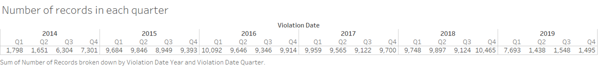
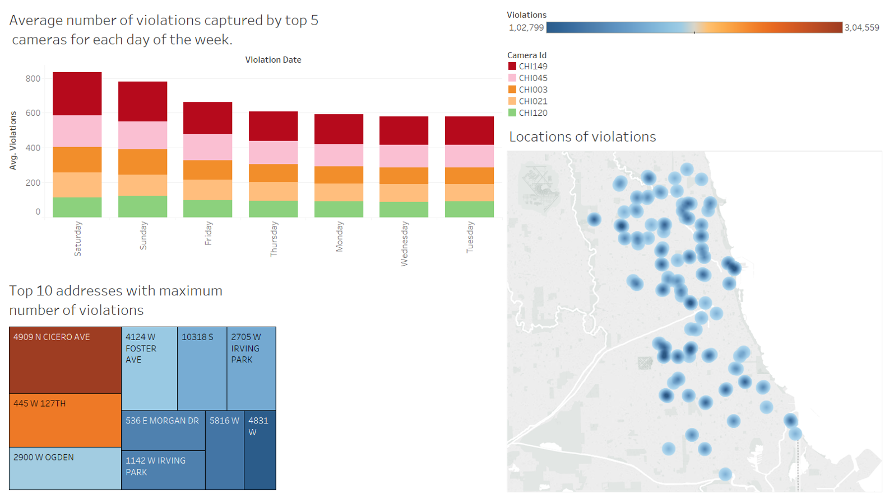
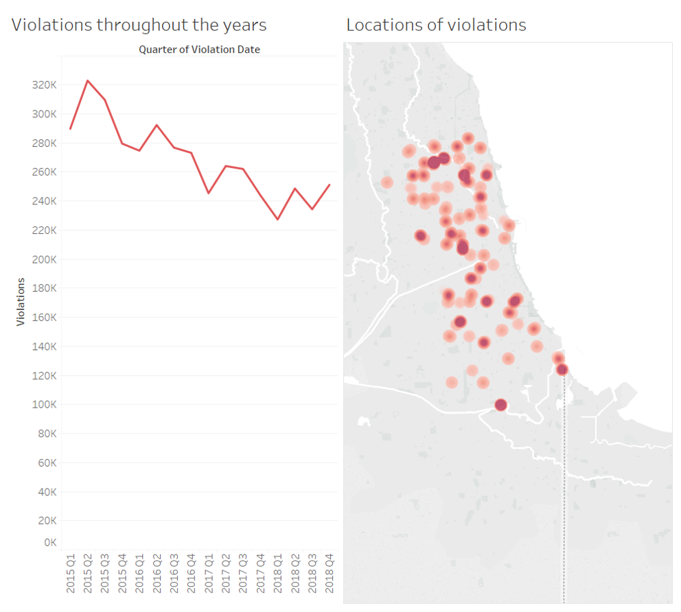
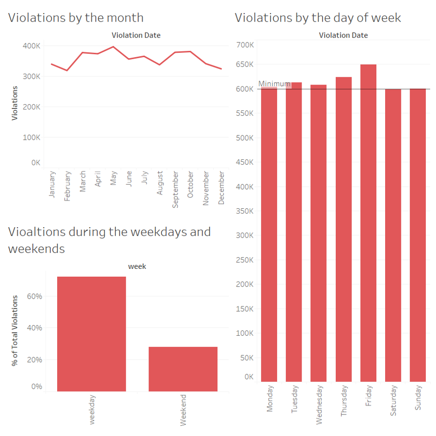

# 'Making of' Document
## *Introduction* :
The dataset is speed camerica violations in Chicago where each record gives the number of violations captured by a particular camera on a given day.

## *Changes made*:
* The first thing I changed from last week's exploratory analysis was the years 2014 and 2019 had number of records too low compared to the rest. This might just be incomplete data or the cameras were intsalled later on in the case of 2014. And 2019 is not complete yet so it won’t be considered.

Therefore, for the point of my analysis I have removed those years.

* And for all my fianl visuals I have just used a shade of red to maintain uniformity in the visuals. The reason why I chose red is that it was clearer than blue in the map plot.

## *Now looking at the graphs I made for the data exploration part*:
### 1st dashboard:

I beleive that **locations of violations** is a good graph to get an understanding of the violations happening in various parts of Chicago and the darker dots tells us that violations are more frequent there.

I think **top 10 addresses with maximum number of violations** is a good plot as well, which clearly shows us the addresses and its violations based on the intensity of the colour. But it might improve by changing the color to a single shade with different intensities, as we know it is better to use minimum colours.

I have considered the **average number of violations per week** but I realised that Saturdays and Sundays have very large outliers hence average will not give us the correct analysis. And also decided to not include the camera id here as a stacked graph as it is not that informative. 

The above plot shows some major outliers during saturday and sunday.

### 2nd dashboard:

**Violations occurring by the month** plot is too colorful, and I sorted the months based on the violations, but I think it could be better to look at the violations occuring throughout the months in the correct order( to see if there are any patterns over the months). And it is too colorful which isn't required here. Hence a line plot can improve this considerably.

**Quarterly violations throughout the years** clearly shows the trend throughout the years but along with removing 2014 and 2019, I would change this to a line graph and make it less colourful,as it conveys the same message in a more straightforward way. And I would change the ordering of the quarter and years, to show a general trend throughout the years for each quarter

## *Police station dataset*:
To obtain more information about the locations of the violations, I have merged the speed violations data set with the police stations in Chicago(find it here: [police station dataset](https://data.cityofchicago.org/Public-Safety/Police-Stations/z8bn-74gv)), where there are police districts and each district has a police station address provided.

This can aid us in getting a better understanding of which police district has higher violations.This can really help reduce speed violations if the respective poilce stations can take certain actions towards it.It would help to know exactly which addresses have many speed violations and which police district it comes under. 

Each record has information about a police district name, along with the station address, latitude longitiude and zipcode.

As the zip codes present in the speed violation dataset was incorrect,I first tried to merge police station data set by  using the zip codes obtained from the ward offices dataset() with the zip codes in the police station dataset, but this contained a lot of null values.So this would not result in a very accurate analysis. Hence my approach was to allocate the police district closest to the location of violations happening.
To see my approach click on the ipynb file here:

## *Finally I used the merged dataset for my visualizations to present to the mayor*:

## 1st visual:

This is the first dashboard which gives us a general understanding of the violations happening and its trends.This plot shows the violations happening throughout the years and a map plot shows the exact locations of violations based on the latitudes and longitudes:

**Approach**: 
Used line graph that shows clear trend of the violations throughout the years, and for maps used density points to show the violations. The higher the number of violations, the darker the density points.

**Final analysis:**
Speed violations are decreasing throughout the years as we can see from the first plot. We can see that for each quarter throughout the years, there is a decreasing trend except for 2018 quarter 4 which has increased from the previous quarter. 

From the locations of violations we can see that speed violations are slightly more in the north of Chicago as there are many points in the north and darker points as compared to the south. This could be because of more population in the north leading to more people violating the rules, or people being faster drivers in the north,or just more traffic.

## 2nd visual:

Now moving on to more specific analysis of the violations based on certain time trends. 

**Approach**:
I wanted to know if there any any patterns based on different, more specific time trends. Therefore, violations over the months and during the days of the week.

**Final analysis**:
There are no significant patterns happening every month, it just ranges from 300,000 to 400,000 for each month.                                                                       
But we do see here that violations happen the least during Saturday and Sunday. I have given a reference line in the plot which indicates the minimum number of violations. Monday through Friday are all higher compared to the minimun. Highest is on Friday.

Therefore to get a more general understanding, I have created a plot which shows the percentage of violations during weekdays and weekends. Weekends do not have a lot of violations as it is just around 30% while weekdays are 70% of the total violations ever happening. A possible explaination coud be that people probably violate the rules because they are running late to work or have a busy schedule. But during the weekend there people are in no rush, hence the violations could be lesser.

## 3rd visual:

**Approach**: Identified the  the total violations happening in each police district. Along with that generated a heat map of the top 10 addresses with maximum violations along with the respective police district and the camera.

**Final analysis**:
Finally it would be helpful to identify the specific areas where the most violations are happening, and their repsecitve closest police stations. To obtain an understanding of the police districts where the most violations are happening, I have created the first bar plot. This shows that Jefferson park police district has the highest number of violations followd by Chicago Lawn and so on. We also see from the second plot that the adress 4909 N cicero ave has highest recorded violations by the camera CHI149 in the Jefferson park police district.

Therefore from this analysis we can suggest that the cops incharge of the few police districts with many speed violations like jefferson park,chicago lawn to probably send out more cops out to these areas to control the violations as people usually follow the rules if they see cops around. This might reduce accidents as well, as speeding sometimes cause major accidents. 

## *Conclusion*:

* We can say from this analysis that
  - Violations are decreasing througout the years,except for 2018 quarter 4, which increased from the previous quarter.
  - More violations are happening in the north of Chicago. 
  - Violations are happening during the week mostly.
  - Police districts with highest number of speed violations are Jefferson Park, Chicago Lawn, Ogden, Lincoln and so on.
  - Address with the highest violations are 4909 N cicero ave in Jefferson Park caught by camera CHI149, followed by 445 W 127th in Calumet caught by camera CHI045
* There could be various reasons as to why this is happening, be it population, or traffic, people are running late or just drive faster. Therefore if we could get any information regarding the same it would lead to a better analysis as we can explain why this is happening even better. 

