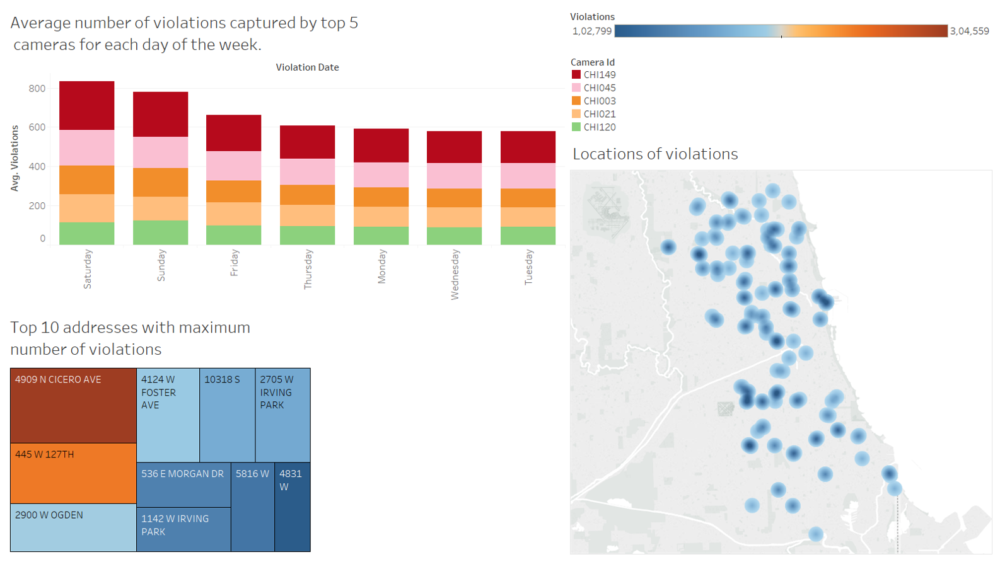
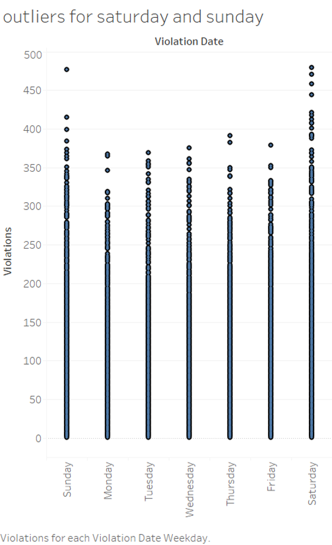
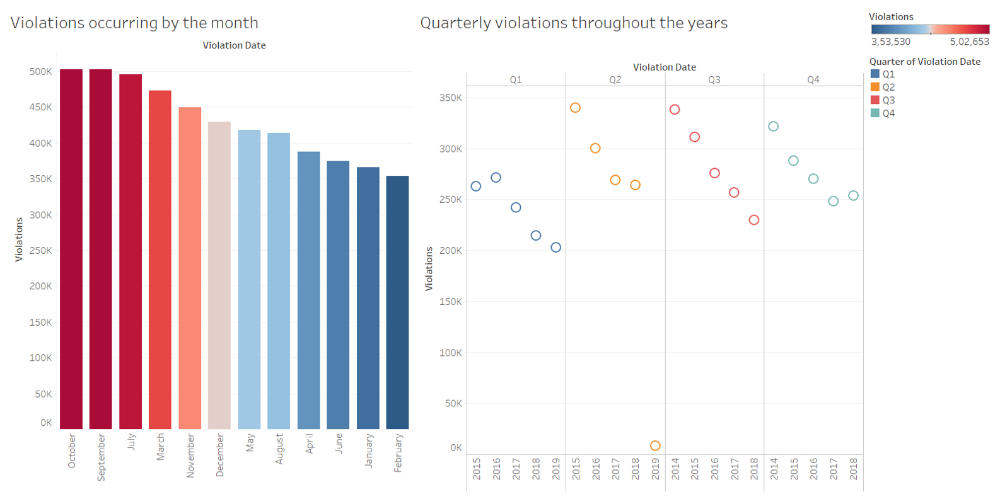
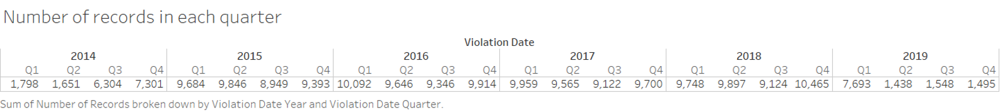
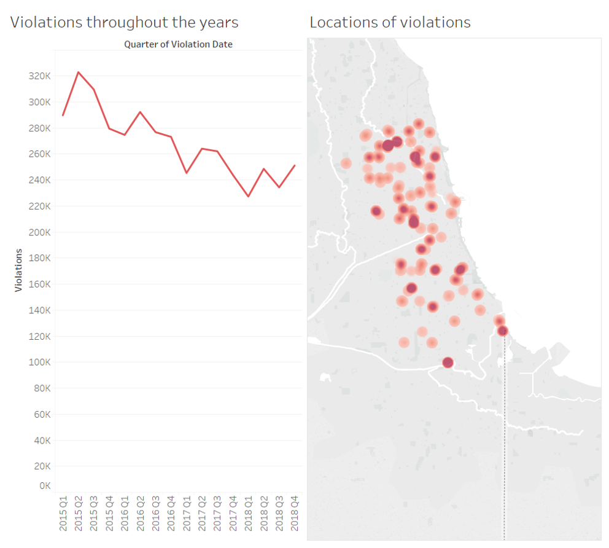
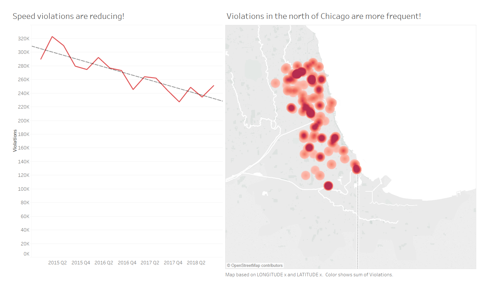
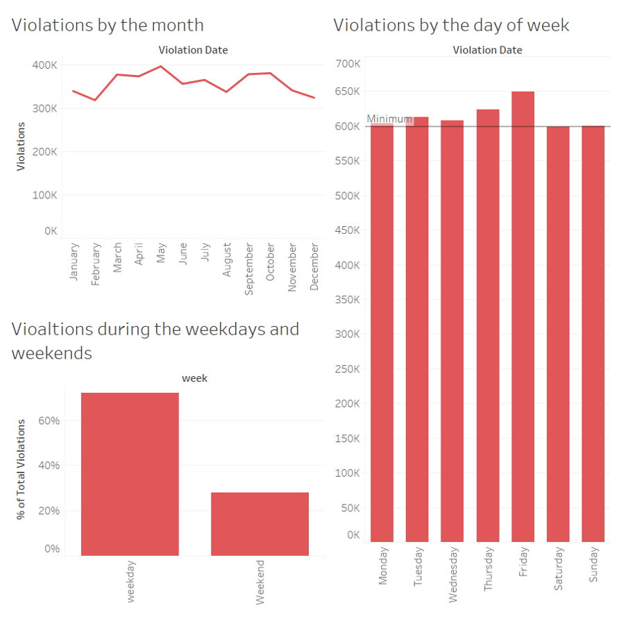
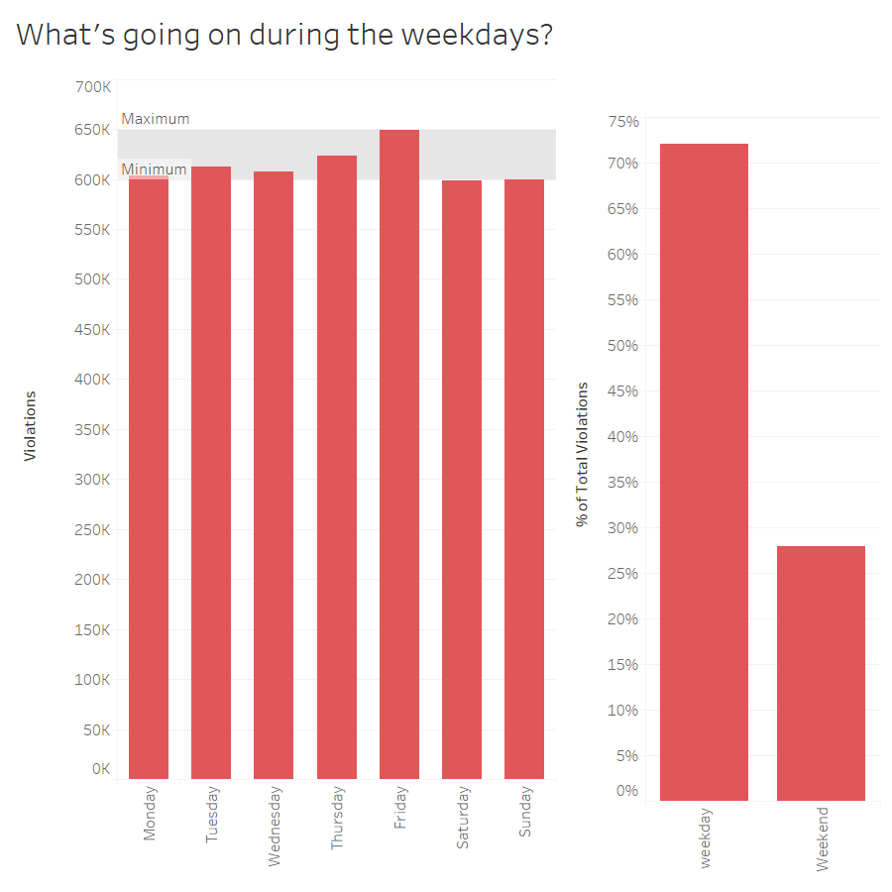
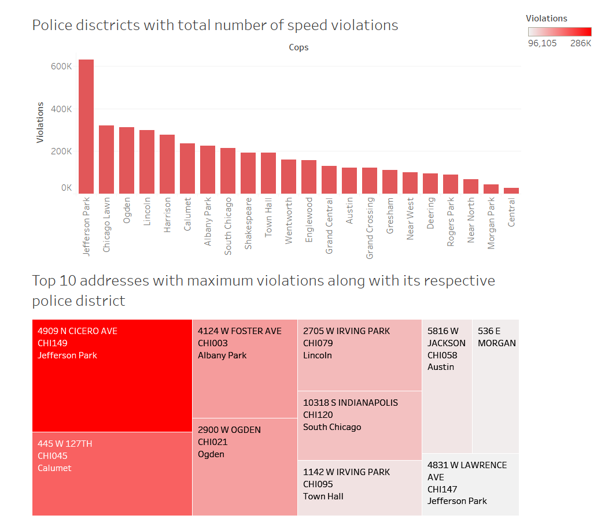
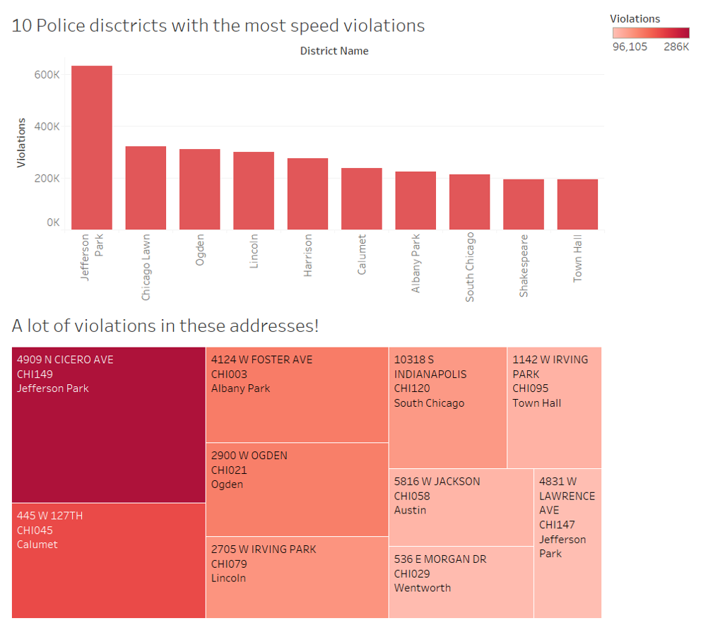

# 'Making of' Document
## *Tableau public link final version* : https://public.tableau.com/profile/shriya8888#!/vizhome/finalversion_15570846544480/Dashboard3
## *Introduction* :
This dataset is speed cameria violations in Chicago where each record gives the number of violations captured by a particular camera on a given day.

## *Initial data exploration and the changes I would make*:
### 1st dashboard:

I believe that **locations of violations** is a good graph to get an understanding of the violations happening in various parts of Chicago and the darker dots tells us that violations are more frequent there.

I think **top 10 addresses with maximum number of violations** is a good plot as well, which clearly shows us the addresses and its violations based on the intensity of the colour. But it might improve by changing the color to a single shade with different intensities, as we know it is better to use minimum colours.

I have considered the **average number of violations per week** but I realised that Saturdays and Sundays have very large outliers hence average will not give us the correct analysis. And also decided to not include the camera id here as a stacked graph as it is not that informative and stacked bars can be confusing to read.

The above plot shows some major outliers during saturday and sunday.

### 2nd dashboard:

**Violations occurring by the month** plot is too colorful, and I sorted the months based on the violations, but I think it could be better to look at the violations occuring throughout the months in the correct order(to see if there are any patterns over the months).  Hence a line plot can improve this considerably.

**Quarterly violations throughout the years** clearly shows the trend throughout the years but along with removing 2014 and 2019, I would change this to a line graph and make it less colourful,as it conveys the same message in a more straightforward way. And I would change the ordering of the quarter and years, to show a general trend throughout the years.

## *Police station dataset*:
To obtain more information about the locations of the violations and the associated police stations, I have merged the speed violations data set with the police stations in Chicago(find it here: [police station dataset](https://data.cityofchicago.org/Public-Safety/Police-Stations/z8bn-74gv)), where there are 25 police districts in Chicago and each district has a police station address provided.

This can aid us in getting a better understanding of which police district has higher violations.This can really help reduce speed violations if the respective poilce stations can take certain actions towards it.It would help to know exactly which addresses have many speed violations and which police district it comes under. 

As the zip codes present in the speed violation dataset was incorrect,I first tried to merge police station data set by using the zip codes obtained from the ward offices dataset([ward datset](https://data.cityofchicago.org/Facilities-Geographic-Boundaries/Ward-Offices/htai-wnw4)) with the zip codes in the police station dataset, but this contained a lot of null values.So this would not result in a very accurate analysis. Hence my approach was to allocate the police district closest to the location of violations happening.To achieve this I used python's cKDTree from scipy package and found the nearest location based on latitudes and longitudes provided on both the data sets. Then concatinated that column to the speed violations data set. Finally merged the dataset based on the district.

I have attached an ipynb file in my repository for the code.

## *General Changes made*:
* The years 2014 and 2019 had number of records too low compared to the rest. This might just be incomplete data or the cameras were intsalled later on in the case of 2014. And 2019 is not complete yet so it won’t be considered.

Therefore, for the point of my analysis I have removed those years.

* And for all my final visuals I have just used a shade of red to maintain uniformity in the visuals. The reason why I chose red is that it was clearer than blue in the map plot.

## *Finally the first and final version of the visualizations I created to present to the mayor are*:

## 1st visual:
This is the first dashboard which gives us a general understanding of the violations happening and its trends.This plot shows the violations happening throughout the years and a map plot shows the exact locations of violations based on the latitudes and longitudes

### *First Version*:

**Approach for the first version**: 
* Used line graph that shows clear trend of the violations throughout the years. I chose line graphs as it is very simple and easy to understand and it clearly shows what is happening throughout the years. 
* For maps, I used density points to show the violations. The higher the number of violations, the darker the density points.

### *Final Version*:

**Approach for the final version**: 
* Decided to modify the plot by adding a trend line for the violations throughout the years as this clearly shows that violations have a decreasing trend.
* Removed X axis title from the top as it is obvious that it signifies years and quarters.
* Renamed both the plots that is more effective than just a decription of the plot. The new titles can generate discussions and identifies the exact thing the plot is trying to convey.
* Also provided caption for the map plot that explains how the plot was generated.

**Final analysis:**
* Speed violations are decreasing throughout the years as we can see from the first plot. We can see that for each quarter throughout the years, there is a decreasing trend except for 2018 quarter 4 which has increased from the previous quarter.But in the long run, it does not make much of a difference. Hence the trend line is decreasing as the years go by. 
* From the locations of violations we can see that speed violations are slightly more in the north of Chicago as there are many points and darker points in the north as compared to the south. This could be because of more population in the north leading to more people violating the rules, or people just driving faster in the north.

## 2nd visual:
Now moving on to more specific analysis of the violations based on certain time trends. I wanted to know if there any any patterns based on different, more specific time trends. Therefore, violations over the months and during the days of the week was explored.

### *First Version*

**Approach for the first version**:
* I have again picked line graph as it is the best in showing clear trends throughout the years. I tried using bar charts as well for this but the differences in each month wasn't as clear as depicted by the line graph.
* But I have used bar graph for the weekday/weekend chart as this is clear and better than line graph as line graph would just be a line for the two points. Hence bar graphs are a more powerful representation in this case. And to maintain consistency, I used bar graph as well for the day of week plot as as they are a more detailed analysis for each day of the week.

### *Final Version*

**Approach for the final version**:
* I have removed the plot that shows violations throughout the month as it does not have any specific trend or pattern, and showing this to the mayor would be of no use.
* Therefore I have renamed the plot that just focuses on the day of week.
* The reference line has been modified to show the whole band for minimum and maximim violations occuring.

**Final analysis**:                                                                     
* Violations happen the least during Saturday and Sunday. Monday through Friday are all higher compared to the minimun. Highest is on Friday.
* Therefore to get a more general understanding, I have created a plot which shows the percentage of violations during weekdays and weekends. Weekends do not have a lot of violations as it is just around 30% while weekdays are 70% of the total violations ever happening. A possible explaination coud be that people probably violate the rules because they are running late to work or have a busy schedule. But during the weekend there people are in no rush, hence the violations could be lesser.

## 3rd visual:
Using the poilce district information to identify districts of high violations.

### *First Version*

**Approach for the first version**: 
* Identified the total violations happening in each police district.Used bar graph and sorted it based on the decreasing number of violations. Again, for me the question was to use line or bar graph, I chose bar graph as it was clear as to which district has how many violations. Line graph was not as effective.
* Along with that I generated a heat map/tree map of the top 10 addresses with maximum violations along with the respective police district and the camera.I chose heat map because I just wanted to show information about the the addresses with many violations. The specific number of violations was not required here as I wanted to show its respective camera id and police district, which looked really cluttered when I tried out other types of graphs like bar, line, circle views and its variations. Heat map was the one that was the best for this scenario.

### *Final Version*

**Approach for the final version**: 
* I have just shown the top ten police districts with maximum violations, as seeing all the districts violations would not be as useful. Hence showing just top ten I think is better.
* The title of the addresses with many violations has been changed as well, as I think this title is more effective.

**Final analysis**:
* Finally it would be helpful to identify the specific areas where the most violations are happening, and their repsecitve closest police stations. To obtain an understanding of the police districts where the most violations are happening, I have created the first bar plot. This shows that Jefferson park police district has the highest number of violations followd by Chicago Lawn and so on. We also see from the second plot that the adress 4909 N cicero ave has highest recorded violations by the camera CHI149 in the Jefferson park police district.
* Therefore from this analysis we can suggest that the police districts with many speed violations like jefferson park,chicago lawn to probably send more cops out to these areas to control the violations as people usually follow the rules if they see cops around. This might improve overall safety out in the roads as well, as speeding sometimes causes major accidents. 

## *Conclusion*:

* We can say from this analysis that
  - Violations are decreasing througout the years,except for 2018 quarter 4, which increased from the previous quarter.
  - More violations are happening in the north of Chicago. 
  - Violations are happening during the week mostly.
  - Police districts with highest number of speed violations are Jefferson Park, Chicago Lawn, Ogden, Lincoln and so on.
  - Address with the highest violations are 4909 N cicero ave in Jefferson Park caught by camera CHI149, followed by 445 W 127th in Calumet caught by camera CHI045
* There could be various reasons as to why this is happening, be it population, or traffic, people are running late or just drive faster. Therefore if we could get any information regarding the same it would lead to a better analysis as we can explain why this is happening even better. 

## All links and websites used for codes and datasets:
* Speed violation dataset: https://data.cityofchicago.org/Transportation/Speed-Camera-Violations/hhkd-xvj4
* Police dataset: https://data.cityofchicago.org/Public-Safety/Police-Stations/z8bn-74gv
* Ward office dataset: https://data.cityofchicago.org/Facilities-Geographic-Boundaries/Ward-Offices/htai-wnw4
* Code for finding nearest location answered by Jhuw :https://gis.stackexchange.com/questions/222315/geopandas-find-nearest-point-in-other-dataframe
* Code for week day and weekend calcualtion in tableau by Joshua Milligan: https://community.tableau.com/thread/125088

